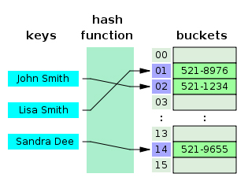

# Hash
 

   

## 1. 해시의 기본적 정의
   - Hash : 임의의 크기/형태를 가진 데이터를 고정된 크기/형태의 데이터로 변환시켜 저장
   - 데이터의 실질적인 값이 되는 Key를 특정 해시 함수 (Hash Function)을 활용하여 변환시킨 결과 값을 인덱스 값으로 활용하여 그 Value에 저장
     - Key : 원본 데이터 값
     - Value : 해싱 처리 후 매핑 된 데이터 값
   - 해당 방식을 활용할 경우 즉시 값의 참조가 가능해져서 더욱 빠른 속도로 처리가 가능
  

## 2. 해시의 실적용
   - 그 구조 특성 상 java에서는 Map 인터페이스의 구현체로서 사용 가능하다
   - 구현체의 종류로 HashMap과 HashTable이 존재
   - 평균 시간복잡도 O(1)로 빠른 속도로 객체 검색이 가능함
  

## 3. HashMap
   - Map 인터페이스를 구현한 Collection(자료구조)
   - Key 값은 중복 불가능, Key가 충돌날 경우 덮어쓰기 되는 방식
   - Key 값의 충돌에 대해서는 별도로 케어하는 방법이 존재한다
     - 분리 연결법(Seperate Chaining)
     - 개방 주소법(Open Addressing)

      
#### 참조
- https://docs.oracle.com/javase/8/docs/api/java/util/HashMap.html
- https://mangkyu.tistory.com/102
- https://hsp1116.tistory.com/35

