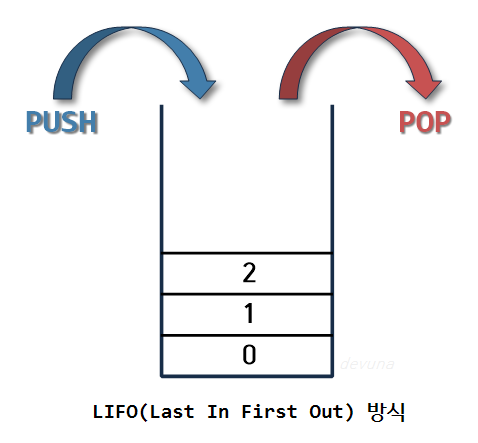

# Stack & Queue
 

 

## 1. 스택의 기본적 정의
   - Stack : 자료구조의 일종으로 자료를 통에 쌓아 올리는 방식의 자료구조이다. 이 통의 특징은 자료의 입출력이 모두 한 곳에서 이루어진다.
   - 자료가 쌓이는 이상 자료가 다시 출력되려면 반드시 위층에 있는 자료부터 출력되어야 한다.
   - Stack에서 활용되는 연산특징
     - Push : Stack 안에 자료를 저장/삽입하는 연산. 자료가 삽입될 경우 그 Stack의 Top에 차근차근 쌓인다.
     - Pop : Stack 안에 자료를 제거/삭제하는 연산. 자료가 삭제될 경우 Stack의 Top부터 자료가 삭제된다.
   - 이를 총괄해서 정리하면 LIFO(Last In First Out) 방식이라고 한다. = 후입선출
   - 대표적인 실적용 예시는 작업 중 실행 취소(undo), 수식 괄호 검사가 해당된다.
    

 
## 2. 큐의 기본적 정의
   - Queue : 줄을 서서 기다리는 것을 자료구조 상으로 구현한 것이다.
   - Stack과 달리 삽입과 삭제가 이루어지는 곳이 서로 다르다. 맨 앞에서 삭제가 수행되며, 맨 뒤에서 자료 삽입이 이루어진다.
   - Queue에서 이루어지는 연산의 특징
     - Put : Queue 안에 자료를 삽입/저장하는 연산. 맨 뒤에서 자료를 삽입하는 방식이다.
     - Get : Queue 안에 자료를 제거/삭제하는 연산. 맨 앞에서 자료를 뽑아내는 방식이다.
   - Pop의 역할을 수행하는 연산
   - 이를 FIFO(First In First Out)이라고 한다. = 선입선출
   - 가장 대표적인 예시는 편의점 음료수 가판대를 보면 쉽게 이해할 수 있다.
  

      
#### 참조
- https://devuna.tistory.com/22
- https://ko.wikipedia.org/wiki/%ED%81%90_(%EC%9E%90%EB%A3%8C_%EA%B5%AC%EC%A1%B0)
